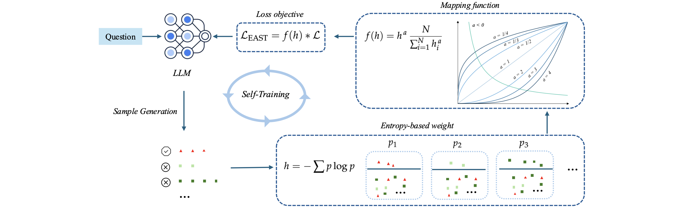

# EAST: Entropy-Based Adaptive Weighting for Self-Training
**EAST** is an adaptive weighting strategy designed to prioritize uncertain data during self-training. Specifically, EAST employs a mapping function with a tunable parameter that controls the sharpness of the weighting, assigning higher weights to data where the model exhibits greater uncertainty. This approach guides the model to focus on more informative and challenging examples, thereby enhancing its reasoning ability.

<!-- 
*Figure 1: Comparison between the traditional self-training pipeline and EAST. The LLM generates $n$ responses per question, clustered by final answers. Questions with all incorrect answers are discarded. Self-training fine-tunes uniformly on the rest, while EAST assigns higher weights to questions with diverse (uncertain) answers and lower weights to consistent (confident) ones.* -->


*Figure 1: The framework of EAST. For each training question, the LLM generates $n$ responses, clustered by final answers. Entropy value is computed from the cluster distribution, transformed via mapping function, and integrated as weight into the loss objective.*

## Updates
[Mar 2025] We release the code and arxiv the paper. 

## Training
Our code is built upon [trl repository](https://github.com/huggingface/trl/tree/main). 

### Training Scripts
```
bash train/run_east_dpo.sh
```
## Results

| Setting    | GSM8K (%) | MATH (%) | AVG (%) | GSM8K (%) | MATH (%) | AVG (%) |
|------------|-----------|----------|---------|-----------|----------|---------|
|            |  |**LLaMA-3.2-1B**  |     |                  | **LLaMA-3.1-8B** |
|            |           |          |         |           |          |         |
| _default_  | 46.2      | 28.5     | 37.3    | 82.8      | 50.4     | 66.6    |
| SFT        | 50.1      | 28.4     | 39.2    | 85.0      | 50.0     | 67.5    |
| +EAST      | 51.8  | 29.4 | 40.6 | 86.1 | 51.2 | 68.6 |
| DPO        | 50.2      | 28.7     | 39.5    | 84.6      | 50.1     | 67.5    |
| +EAST      | 51.9 | 29.7 | 40.8 | 85.4 | 50.9 | 68.1 |
| KTO        | 53.0  | 28.8     | 40.9    | 83.9      | 48.9     | 66.4    |
| +EAST      | 53.0  | 29.9 | 41.5 | 85.1 |  51.0 | 68.1 |
